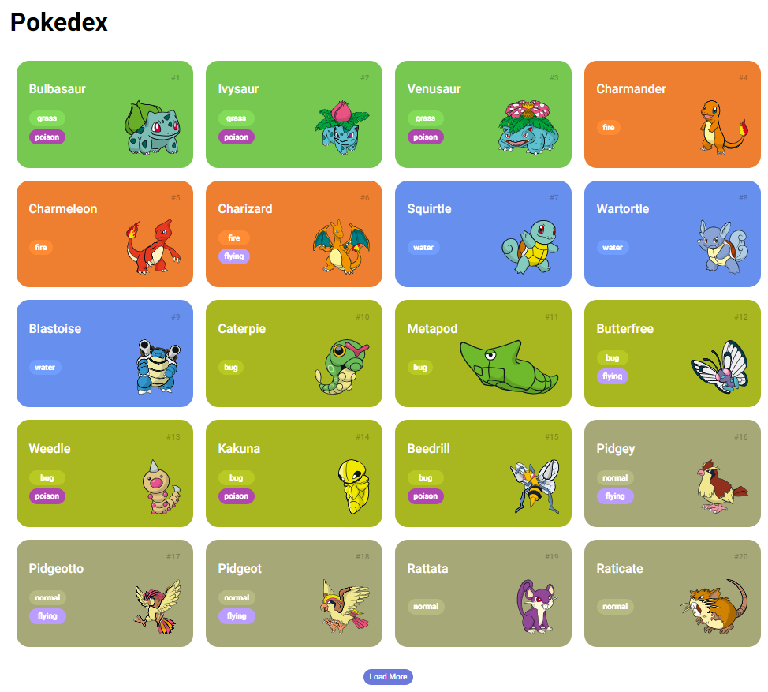

# Pokedex

Esta é uma Pokedex simples desenvolvida em HTML, CSS e JavaScript. Ela consome dados de uma API para exibir informações sobre os Pokémon. 

## Demonstração



## Funcionalidades

- Exibe uma lista de Pokémon com suas respectivas imagens, nomes, números e tipos.
- Permite carregar mais Pokémon ao clicar no botão "Load More".

## Como usar

1. Clone este repositório:
```bash
git clone https://github.com/Alvarezpro87/pokedex.git
```

2. Abra o arquivo `index.html` em seu navegador ou hospede-o em um servidor web.

## Estrutura do projeto

- `index.html`: O arquivo HTML principal que define a estrutura da página.
- `assets/`: Pasta contendo arquivos CSS, JavaScript e imagens.
  - `css/`: Arquivos CSS para estilizar a página.
  - `js/`: Arquivos JavaScript para a lógica da aplicação.
  - `img/`: Imagens utilizadas no projeto.

## Créditos

- Alexandre Alvarez
- Contato: alvarezpro87@gmail.com

